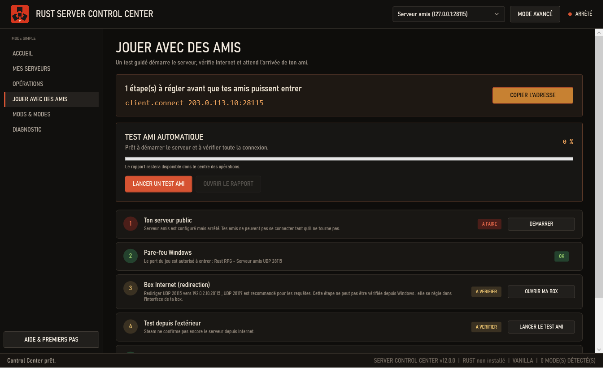
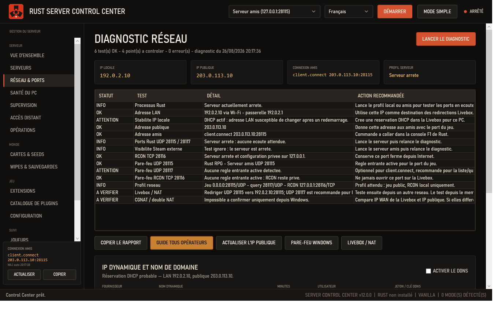

# User guide — Rust Server Control Center

## First server

1. Run `RustServerControlCenter-Setup-v12.1.0.exe`.
2. Choose Vanilla, Carbon, or Oxide in the setup wizard.
3. Create the server, then select **Start**. The Rust console stays hidden.
4. In Rust, open F1 and paste the displayed `client.connect` command.

## Test a friend connection

Open **Play with friends** and select **Run friend test**. The tool starts the public instance, waits for the map, checks ports and Windows Firewall, asks Steam whether the server is externally visible, refreshes `CONNEXION-AMIS.txt`, and waits for a player. It displays one share command. If something fails, **Open report** identifies the failed check and recommended action.

## Changing IP addresses

The **Network** page tracks the LAN and public addresses and indicates whether a DHCP reservation appears to be present. Address changes produce an alert and regenerate the connection file.

- DuckDNS: enter the domain and token.
- No-IP: enter the hostname, DDNS key username, and key password.
- The secret is protected by Windows DPAPI for the current user.

## Without port forwarding

- **Integrated Tailscale**: under **Network & ports**, select **Install Tailscale**, then **Log in**. After browser authentication, **Use for Rust** enables the profile and copies the correct command. **Invite a friend** opens the official invitation page and **Copy friend guide** prepares instructions to send. Every player must install Tailscale and join the same private network. The Control Center verifies the installer signature and stores no Tailscale credentials. A direct peer-to-peer path has the best latency; a DERP relay can be slower.
- **Public UDP tunnel**: enter the relay host and port. Forward it to the local UDP game port; a second query-port tunnel is recommended for Steam discovery.
- **Direct**: lowest latency, but requires UDP forwarding on the router.

Never share the RCON password, DDNS token, or `data` directory. Friend-test reports do not include those secrets.
